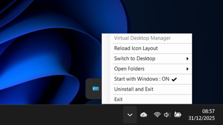
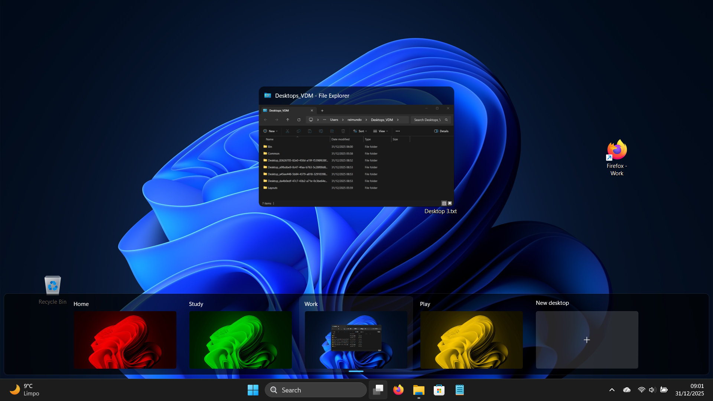

# Virtual Desktop Manager

A Windows application that provides **separate desktop folders** for each Windows Virtual Desktop, with automatic icon layout management and desktop switching capabilities.

[](https://dotnet.microsoft.com/download)
[](https://www.microsoft.com/windows)

## ✨ Features

### 🖥️ **Per-Desktop Folders**
- Each virtual desktop gets its own dedicated folder
- Automatically switches Windows Desktop path when you switch virtual desktops
- Keep your desktop organized with context-specific files and shortcuts

### 📐 **Icon Layout Management**
- Automatically saves and restores desktop icon positions
- Multi-monitor support with intelligent screen adaptation
- Maintains layouts even when screen configuration changes

### 🔄 **Seamless Desktop Switching**
- Monitors virtual desktop changes in real-time
- Automatic folder switching and icon restoration
- No manual intervention required

### 🗑️ **Smart Cleanup**
- Automatically removes folders for deleted virtual desktops
- Moves files to a recycle bin folder instead of permanent deletion
- Cleans up orphaned icon layout files

### 🚀 **Startup & Installation**
- Optional Windows startup integration
- Automatic self-installation to `%UserProfile%\Desktops_VDM\Common`
- System tray icon for easy access

### 📢 **Notifications**
- Windows toast notifications for important events
- Configurable notification duration
- Visual feedback for desktop switches and errors

## 📸 Screenshots

<div align="center">
   <table style="border: none; border-collapse: separate;">
     <tr>
       <td align="center" width="50%">
         
         <sub><b>System Tray Menu</b></sub>
         <br/>
         <sub>Right-click to access all features</sub>
         <br/><br/>
       </td>
       <td align="center" width="50%">
         
         <sub><b>Toast Notifications</b></sub>
         <br/>
         <sub>Real-time alerts and notifications</sub>
         <br/><br/>
       </td>
     </tr>
     <tr>
       <td align="center" width="50%">
         
         <sub><b>Organized Folder Structure</b></sub>
         <br/>
         <sub>Each desktop gets its own folder</sub>
         <br/><br/>
       </td>
       <td align="center" width="50%">
         
         <sub><b>Virtual Desktops Integration</b></sub>
         <br/>
         <sub>Seamless Windows integration</sub>
         <br/><br/>
       </td>
     </tr>
   </table>
</div>

## 📋 Requirements

- **OS**: Windows 10 (1903+) or Windows 11
- **Framework**: .NET 8.0 Runtime
- **Virtual Desktops**: Windows built-in Virtual Desktop feature

## 🚀 Quick Start

1. **Download** the latest release
2. **Run** `Virtual-Desktop-Manager.exe`
3. The app will:
   - Install itself to `%UserProfile%\Desktops_VDM\Common`
   - Create a system tray icon
   - Start monitoring virtual desktop changes

4. **Switch** between virtual desktops (Win+Ctrl+Arrow keys)
5. Your desktop folder and icon layouts will automatically switch!

## 📁 Folder Structure

The application creates the following folder structure in your user profile: 
```
%UserProfile%\Desktops_VDM\
├── Common\                      # Application installation folder
│   ├── Virtual-Desktop-Manager.exe
│   ├── main.ico
│   └── [dependencies]
├── Layouts\                     # Icon layout files
│   ├── Layout_{GUID}.json
│   └── Layout_00000000-0000-0000-0000-000000000000.json  # Original desktop
├── Bin\                        # Deleted desktop items
├── Desktop_{GUID-1}\           # Virtual Desktop 1 files
├── Desktop_{GUID-2}\           # Virtual Desktop 2 files
└── Desktop_{GUID-N}\           # Additional virtual desktops
```

## 🎛️ System Tray Menu

Right-click the tray icon to access:

- **Reload Icon Layout** - Manually reload the current desktop's icon positions
- **Switch to Desktop** - Quickly switch between virtual desktops
- **Open Folders** - Access desktop folders in Windows Explorer
  - Default Desktop
  - Root folder
  - Bin folder
  - Individual virtual desktop folders
- **Start with Windows** - Toggle automatic startup
- **Uninstall and Exit** - Clean uninstall with data removal option
- **Exit** - Close the application

## 🔧 Configuration

### Startup with Windows

Toggle automatic startup via the system tray menu. Registers the application in the Windows Registry at:
```
HKEY_CURRENT_USER\Software\Microsoft\Windows\CurrentVersion\Run
```

### Icon Layout Files

Icon layouts are stored as JSON files in `%UserProfile%\Desktops_VDM\Layouts\`:
```json
{
  "Icons": [
    {
      "Name": "This PC",
      "X": 20,
      "Y": 20,
      "ScreenIndex": 0,
      "IsPrimaryScreen": true
    }
  ],
  "ScreenConfig": {
    "Screens": [...],
    "PrimaryScreenIndex": 0
  },
  "SavedAt": "2025-12-30T10:30:00"
}
```

## 🏗️ Architecture

### Core Components

- **AppCore** - Main application coordinator
- **VirtualDesktopService** - COM interop for Virtual Desktop API
- **DesktopFolderManager** - Windows Desktop path management
- **IconLayoutManager** - Icon position save/load
- **CleanupManager** - Unused folder cleanup
- **InstallationManager** - Self-installation logic
- **StartupManager** - Windows startup integration
- **UninstallManager** - Clean uninstallation

### Workflow

1. **Desktop Change Detection** (100ms polling)
2. **Save Current Layout** (icon positions)
3. **Switch Desktop Folder Path** (SHSetKnownFolderPath)
4. **Refresh Shell** (SHChangeNotify)
5. **Load New Layout** (restore icon positions)
6. **Cleanup** (remove unused folders/layouts)

## 🛠️ Building from Source

### Prerequisites
- Visual Studio 2022 or later
- .NET 8.0 SDK

### Build Steps
```bash
git clone https://github.com/Raimundo30/Virtual-Desktop-Manager.git
cd Virtual-Desktop-Manager
dotnet restore
dotnet build -c Release
```

### Run
```bash
dotnet run
```

**Note**: For development, you may need to disable the installer in `Program.cs`:
```csharp
// NOTE: for development purposes, you need to disable the installer
if (InstallationManager.RunInstaller(paths))
{
    // Comment out or skip for development
}
```
## ⚠️ Known Limitations

- Uses undocumented Windows Virtual Desktop COM APIs (may break with Windows updates)
- Icon position restoration has ~200ms delay for shell refresh
- Unable to paste files from a desktop after switching virtual desktops (clipboard loses file path references)
- Multi-monitor setups with different resolutions may require position adjustment

## 🔮 Planned Features

The following features are currently under development or planned for future releases:

### 📋 **Copy-Paste Fix**
- Preserve clipboard file paths when switching virtual desktops
- Maintain file references across desktop changes
- Seamless copy-paste workflow between desktops

### 🔗 **Follow Along**
- Configure specific applications to automatically follow you across virtual desktops
- Keep essential tools always accessible regardless of which desktop you're on
- Customizable per-application settings

### ⌨️ **Keyboard Shortcuts**
- **Move Active Window**: `Shift + Win + Arrow` / `Shift + Win + Number` - Move the active application window between virtual desktops
- **Switch Desktop**: `Ctrl + Win + Number` - Jump directly to a specific virtual desktop by number
- Fully customizable key bindings

### 🎨 **Title Bar Integration**
- Add virtual desktop controls directly to application title bars
- Right-click title bar to move windows between desktops
- Quick-access menu for desktop management
- Visual indicators showing which desktop a window belongs to

## 🐛 Troubleshooting

### Icons not restoring correctly
- Try **Reload Icon Layout** from the tray menu
- Check that the layout file exists in `%UserProfile%\Desktops_VDM\Layouts\`
- Verify screen configuration hasn't changed significantly

### Desktop folder not switching
- Ensure you have write permissions to `%UserProfile%\Desktops_VDM`
- Check Windows Event Viewer for Shell errors
- Restart Explorer.exe

### Application won't start
- Verify .NET 8.0 Runtime is installed
- Check `%UserProfile%\Desktops_VDM\Common\` for corrupted files
- Run from original download location to trigger reinstallation

## 📝 License

This project is currently unlicensed. All rights reserved.

## 🙏 Acknowledgments

- Virtual Desktop COM interop based on [Markus Scholtes' VirtualDesktop](https://github.com/MScholtes/VirtualDesktop)
- Uses [Microsoft.Toolkit.Uwp.Notifications](https://github.com/CommunityToolkit/WindowsCommunityToolkit) for toast notifications

## 🤝 Contributing

Contributions are welcome! Please feel free to submit a Pull Request.

1. Fork the repository
2. Create your feature branch (`git checkout -b feature/AmazingFeature`)
3. Commit your changes (`git commit -m 'Add some AmazingFeature'`)
4. Push to the branch (`git push origin feature/AmazingFeature`)
5. Open a Pull Request

## 📧 Support

- **Issues**: [GitHub Issues](https://github.com/Raimundo30/Virtual-Desktop-Manager/issues)

---

**Made with ❤️ for Windows productivity enthusiasts**
